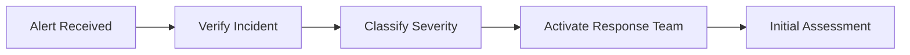

# INCIDENT RESPONSE PLAN
## Astral Core Mental Health Platform

### VERSION: 1.0.0
### CLASSIFICATION: CONFIDENTIAL
### EFFECTIVE DATE: August 30, 2025

---

## 🚨 EMERGENCY CONTACTS

### PRIMARY INCIDENT RESPONSE TEAM
| Role | Name | Contact | Availability |
|------|------|---------|--------------|
| Incident Commander | [REDACTED] | [PHONE] | 24/7 |
| Security Lead | [REDACTED] | [PHONE] | 24/7 |
| Privacy Officer | [REDACTED] | [PHONE] | Business Hours |
| Legal Counsel | [REDACTED] | [PHONE] | On-Call |
| Communications Lead | [REDACTED] | [PHONE] | Business Hours |

### ESCALATION CHAIN
1. **Level 1:** Security Analyst → Security Lead
2. **Level 2:** Security Lead → Incident Commander
3. **Level 3:** Incident Commander → Executive Team
4. **Level 4:** Executive Team → Board of Directors

---

## 1. INCIDENT CLASSIFICATION

### SEVERITY LEVELS

#### 🟢 LOW (SEV-4)
- Single user affected
- No PHI exposure
- Service degradation < 5%
- Resolution time: 4 hours

#### 🟡 MEDIUM (SEV-3)
- Multiple users affected (< 100)
- Potential PHI exposure risk
- Service degradation 5-25%
- Resolution time: 2 hours

#### 🟠 HIGH (SEV-2)
- Department/region affected
- Confirmed PHI exposure (< 500 records)
- Service degradation 25-50%
- Resolution time: 1 hour

#### 🔴 CRITICAL (SEV-1)
- Platform-wide impact
- Mass PHI exposure (> 500 records)
- Complete service outage
- Resolution time: 30 minutes

---

## 2. INCIDENT TYPES

### 2.1 DATA BREACH
**Definition:** Unauthorized access, use, or disclosure of PHI

**Immediate Actions:**
1. Isolate affected systems
2. Preserve evidence
3. Stop ongoing data exfiltration
4. Document all affected records
5. Initiate breach notification process

### 2.2 RANSOMWARE ATTACK
**Definition:** Malicious encryption of systems/data with ransom demand

**Immediate Actions:**
1. Disconnect affected systems from network
2. Activate backup systems
3. Contact law enforcement
4. Do NOT pay ransom
5. Begin recovery from clean backups

### 2.3 DDOS ATTACK
**Definition:** Distributed denial of service affecting platform availability

**Immediate Actions:**
1. Activate DDoS mitigation
2. Enable rate limiting
3. Contact CDN provider
4. Redirect traffic to backup infrastructure
5. Collect attack signatures

### 2.4 INSIDER THREAT
**Definition:** Malicious or negligent actions by authorized users

**Immediate Actions:**
1. Disable user accounts
2. Revoke all access tokens
3. Audit all user activities
4. Preserve evidence for legal action
5. Review access logs

### 2.5 ACCOUNT COMPROMISE
**Definition:** Unauthorized access to user or admin accounts

**Immediate Actions:**
1. Force password reset
2. Terminate all sessions
3. Enable MFA if not active
4. Review account activity
5. Check for lateral movement

---

## 3. RESPONSE PHASES

### PHASE 1: DETECTION & ANALYSIS (0-15 minutes)


**Checklist:**
- [ ] Confirm incident is real (not false positive)
- [ ] Determine incident type and severity
- [ ] Identify affected systems and data
- [ ] Estimate number of affected users
- [ ] Document initial observations
- [ ] Notify response team via secure channel

### PHASE 2: CONTAINMENT (15-60 minutes)


**Short-term Actions:**
- [ ] Isolate affected systems
- [ ] Block malicious IPs/domains
- [ ] Disable compromised accounts
- [ ] Implement emergency patches
- [ ] Increase monitoring

**Long-term Actions:**
- [ ] Deploy clean systems
- [ ] Patch vulnerabilities
- [ ] Update security controls
- [ ] Implement additional monitoring
- [ ] Review and update firewall rules

### PHASE 3: ERADICATION (1-4 hours)
**Actions:**
- [ ] Remove malware/malicious code
- [ ] Delete unauthorized accounts
- [ ] Reset all passwords
- [ ] Patch all vulnerabilities
- [ ] Update security signatures
- [ ] Verify system integrity

### PHASE 4: RECOVERY (4-24 hours)
**Actions:**
- [ ] Restore from clean backups
- [ ] Rebuild affected systems
- [ ] Validate system functionality
- [ ] Monitor for re-infection
- [ ] Verify data integrity
- [ ] Gradual service restoration

### PHASE 5: POST-INCIDENT (24-72 hours)
**Actions:**
- [ ] Complete incident report
- [ ] Conduct lessons learned session
- [ ] Update security controls
- [ ] Revise response procedures
- [ ] Implement preventive measures
- [ ] Schedule follow-up review

---

## 4. COMMUNICATION PROTOCOLS

### 4.1 INTERNAL COMMUNICATIONS
**Secure Channels:**
- Primary: Encrypted messaging system
- Secondary: Secure phone bridge
- Emergency: Out-of-band communication

**Update Frequency:**
- SEV-1: Every 15 minutes
- SEV-2: Every 30 minutes
- SEV-3: Every hour
- SEV-4: Every 2 hours

### 4.2 EXTERNAL COMMUNICATIONS

#### Users/Patients
**Timeline:** Within 2 hours of confirmation
**Method:** In-app notification, email, website banner
**Content:**
- Nature of incident (general terms)
- Potential impact
- Actions being taken
- Recommended user actions
- Support contact information

#### Media/Public
**Timeline:** Within 4 hours for SEV-1/2
**Method:** Press release, social media
**Spokesperson:** Communications Lead only

#### Regulatory Bodies
**Timeline:** Per regulatory requirements
- HHS: Within 60 days
- State authorities: Per state law
- International: Per GDPR (72 hours)

---

## 5. EVIDENCE COLLECTION

### 5.1 PRESERVATION REQUIREMENTS
**Critical Evidence:**
- System logs (7 years retention)
- Network traffic captures
- Memory dumps
- Disk images
- Configuration files
- User activity logs

### 5.2 CHAIN OF CUSTODY
```
Evidence ID: [YYYY-MM-DD-###]
Collected by: [Name]
Date/Time: [ISO-8601]
Location: [System/Network]
Hash: [SHA-256]
Storage: [Secure location]
Access log: [All personnel who accessed]
```

### 5.3 FORENSIC TOOLS
- Memory analysis: Volatility
- Disk forensics: Autopsy
- Network analysis: Wireshark
- Log analysis: Splunk
- Malware analysis: Sandbox environment

---

## 6. SPECIFIC PLAYBOOKS

### 6.1 MENTAL HEALTH CRISIS DURING INCIDENT
**Priority:** Ensure continuous crisis support availability

**Actions:**
1. Activate backup crisis hotlines
2. Deploy emergency static crisis page
3. Enable offline crisis resources
4. Alert crisis counselors
5. Implement manual intervention protocols

### 6.2 PHI BREACH RESPONSE
**Legal Requirements:**
- Individual notification: 60 days
- HHS notification: 60 days
- Media notification: 60 days (if >500 individuals)

**Notification Content:**
1. Description of breach
2. Types of information involved
3. Steps individuals should take
4. Steps organization is taking
5. Contact information for questions

### 6.3 ANONYMOUS USER PROTECTION
**Special Considerations:**
- Preserve anonymity during investigation
- Use aggregate reporting only
- No individual user tracking
- Enhanced privacy controls
- Legal consultation required

---

## 7. RECOVERY PROCEDURES

### 7.1 BACKUP ACTIVATION
**Priority Order:**
1. Crisis support systems
2. Authentication services
3. Core platform functionality
4. Secondary features
5. Analytics and reporting

### 7.2 DATA RESTORATION
**Verification Steps:**
- [ ] Integrity check (checksums)
- [ ] Completeness verification
- [ ] Time stamp validation
- [ ] Access control restoration
- [ ] Encryption verification

### 7.3 SERVICE RESTORATION
```
Phase 1: Core Services (0-2 hours)
- Authentication
- Crisis support
- Basic platform access

Phase 2: Primary Features (2-4 hours)
- Messaging
- Journaling
- Mood tracking

Phase 3: Full Restoration (4-8 hours)
- All features
- Third-party integrations
- Analytics
```

---

## 8. TESTING AND MAINTENANCE

### 8.1 TESTING SCHEDULE
| Test Type | Frequency | Participants |
|-----------|-----------|--------------|
| Tabletop Exercise | Quarterly | Response Team |
| Simulation | Semi-Annual | All IT Staff |
| Full Test | Annual | Organization-wide |
| Communication Test | Monthly | Response Team |

### 8.2 PLAN UPDATES
**Triggers for Update:**
- After any incident
- Significant infrastructure changes
- New threat intelligence
- Regulatory changes
- Annual review

### 8.3 TRAINING REQUIREMENTS
**Response Team:**
- Initial: 8 hours
- Annual: 4 hours
- Incident debriefs: As needed

**All Staff:**
- Initial: 2 hours
- Annual: 1 hour
- Security awareness: Monthly

---

## 9. METRICS AND REPORTING

### 9.1 KEY METRICS
- Mean Time to Detect (MTTD)
- Mean Time to Respond (MTTR)
- Mean Time to Contain (MTTC)
- Mean Time to Recover (MTTR)
- Number of incidents by type
- False positive rate

### 9.2 REPORTING REQUIREMENTS
**Internal Reports:**
- Executive summary: Within 24 hours
- Detailed report: Within 72 hours
- Lessons learned: Within 1 week
- Action items: Within 2 weeks

**External Reports:**
- Regulatory: Per requirements
- Insurance: Within 48 hours
- Partners: Within 72 hours
- Public: As appropriate

---

## 10. APPENDICES

### APPENDIX A: CONTACT LISTS
[Detailed contact information - REDACTED]

### APPENDIX B: SYSTEM INVENTORY
[Critical systems and dependencies - SEPARATE DOCUMENT]

### APPENDIX C: VENDOR CONTACTS
[Third-party support contacts - REDACTED]

### APPENDIX D: REGULATORY REQUIREMENTS
- HIPAA Breach Notification Rule
- State breach notification laws
- GDPR Article 33 & 34
- Industry-specific requirements

### APPENDIX E: TEMPLATES
1. Incident Report Template
2. Breach Notification Letters
3. Executive Briefing Template
4. Lessons Learned Template
5. Evidence Collection Form

---

## APPROVAL AND AUTHORIZATION

This Incident Response Plan has been reviewed and approved by:

**Chief Security Officer:** ___________________ Date: ___________

**Chief Technology Officer:** _________________ Date: ___________

**Chief Executive Officer:** __________________ Date: ___________

**Legal Counsel:** ___________________________ Date: ___________

---

## DOCUMENT CONTROL

| Version | Date | Author | Changes |
|---------|------|--------|---------|
| 1.0.0 | 2025-08-30 | Security Team | Initial plan |

**Next Review:** September 30, 2025
**Distribution:** Incident Response Team, Executive Team
**Classification:** CONFIDENTIAL - Need to Know Basis

---

*This document contains sensitive security information. Unauthorized disclosure may compromise the organization's ability to respond to security incidents effectively.*